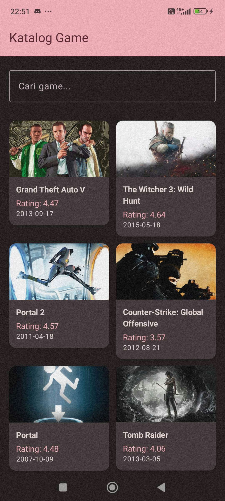
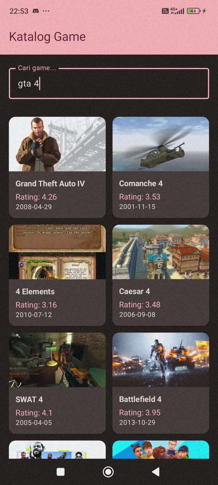
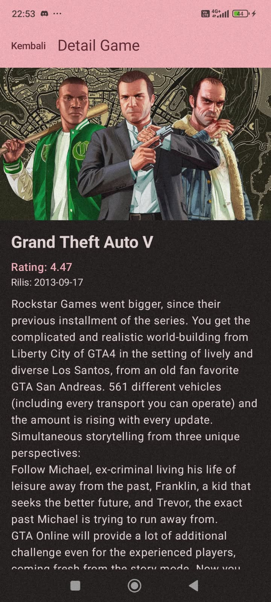

# Responsi Mobile F — Katalog Video Game (RAWG API)

**Nama:** Nathanael Jovan Wahyudi
**NIM:** H1D024048
**Shift Praktikum:** F

Aplikasi Android katalog video game yang mengambil data dinamis dari RAWG API. Menampilkan daftar game, pencarian server-side, dan detail game.

## Screenshot





## Fitur vs Syarat Responsi

- **Kotlin:** `data class` (Game, GameDetail, GamesResponse), null safety (`String?`, `?: "-"`), lambda (`onClick: () -> Unit`)
- **UI:** Jetpack Compose + Material 3 + `ResponsiMobileFTheme` + Typography
- **List:** `LazyVerticalGrid` 2 kolom (pilih satu dari syarat, tidak pakai LazyColumn)
- **State:** `MutableStateFlow` + `collectAsState()` → recomposition otomatis. Search tiap ketik memanggil API ulang
- **Networking RAWG:**
  - Base: `https://api.rawg.io/api/`
  - List: `GET games?key=XXX&page_size=20&search=...` → `name`, `rating`, `released` (YYYY-MM-DD), `background_image`
  - Detail: `GET games/{id}?key=XXX` → tambah `description_raw`
- **Architecture MVVM:** `RawgApiService` (Retrofit) → `GameRepository` → `GameViewModel` → Screen
- **Screens:**
  - Home (`home`): judul + rating + tanggal rilis + search bar
  - Detail (`detail/{gameId}`): judul + rating + tanggal + deskripsi + gambar, tombol Kembali

## Struktur Kode

```
com.example.responsimobilef
├── data/model/        → Game.kt, GamesResponse.kt, GameDetail.kt
├── data/repository/   → GameRepository.kt
├── network/           → RawgApiService.kt (ApiInterface + ApiClient by lazy)
├── ui/viewmodel/      → GameViewModel.kt (GameUiState, DetailUiState)
├── ui/screen/         → HomeScreen.kt, DetailScreen.kt
├── ui/theme/          → Theme.kt, Type.kt
├── util/              → GameConstants.kt (BASE_URL, API_KEY)
└── MainActivity.kt    → NavHost (home → detail/{gameId})
```

Alur: Screen `collectAsState()` → `ViewModel.fetchGames()/fetchDetail()` → `Repository` → `ApiClient.instance` (Retrofit + GsonConverter) → RAWG. `Loading/Success/Error` dirender pakai `when(state)`.

## Dependencies

- `com.squareup.retrofit2:retrofit:3.0.0`
- `com.squareup.retrofit2:converter-gson:3.0.0`
- `io.coil-kt:coil-compose:2.4.0` (AsyncImage)
- `androidx.navigation:navigation-compose:2.10.0`
- `INTERNET` permission di `AndroidManifest.xml`

## Cara Jalankan

1. Daftar key di https://rawg.io/apidocs
2. Isi di `util/GameConstants.kt`: `API_KEY`
3. Sync Gradle → Run di emulator/HP (butuh internet)